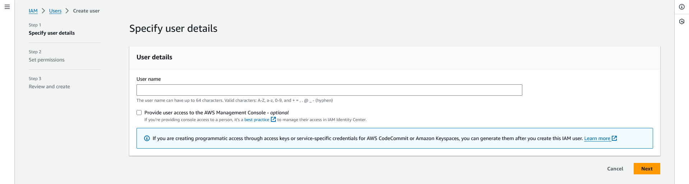
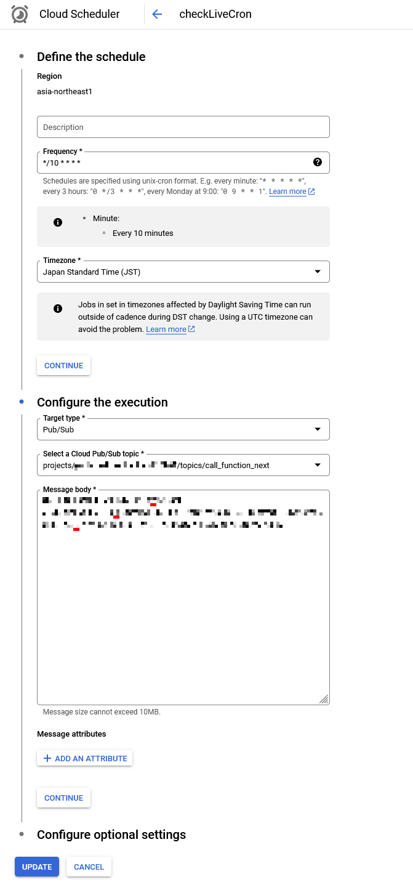

# youtube-live-checker
日本語版は[こちら](https://github.com/f122apg/youtube-live-checker/blob/cloud_functions/README_ja.md)

This tool is used to record and notify you when a stream is started on a particular Youtube Channel.

**This branch is a version designed on Google Cloud Platform.**
If you want to run locally, please check [here](https://github.com/f122apg/youtube-live-checker/tree/master).

## Architecture


## Installation
### Requirement
* Google Cloud Platform Account
* Amazon Web Service Account

### How to install
#### Advance preparation
1. `git clone` the `cloud_functions` branch.
1. copy [tmpl_message_body.csv](https://github.com/f122apg/youtube-live-checker/blob/cloud_functions/gcp/cloud_scheduler/tmpl_message_body.csv) and create `message_body.csv`.
1. put the IDs of the channels you want to record in `message_body.csv`, separated by commas.
*ChannelID must be converted from `@UserName` to get a string of the form `Uxxxxxxxxxxxxxxxxxxxxxxxxxxxxxxxxxxx`.  
 ChannelID can be obtained from the following tools.  
https://www.streamweasels.com/tools/youtube-channel-id-and-user-id-convertor/

#### Working with AWS
1. create a topic on Amazon SNS.
*The region should be created in `ap-northeast-1`.
 If you change the region, please change the region of `deploy.bat` as well.


1. create a subscription with `Protocol: Email` to the topic you created, and set the email address you want to be notified.


1. copy the ARN on the topic details.


1. create a user in AWS IAM.



1. Policy must be applied AmazonSNSFullAccess.


1. press [Create user].


1. Access the detail screen of the created user and press [Create access key].


1. select [Local code].


1. Press [Create access key].


1. copy the `Access key` and `Secret access key`, which will be used when deploying with GCP.


#### Working with GCP
1. create a project in Google Cloud Platform.
1. copy the project ID, which will be used when deploying in GCP.

#### Working with PC
1. install [gcloud](https://cloud.google.com/sdk/docs/install) and [initialize](https://cloud.google.com/sdk/docs/initializing).
1. run `deploy.bat`.
1. it will automatically deploy to GCP.

#### Check the operation
1. open GCP's [Workflows list screen](https://console.cloud.google.com/workflows).
1. open `check_live` detail and click "EXECUTE".
1. Put the following json and press "EXECUTE".
    ``` json
    {
      "contentId": "jNQXAC9IVRw",
      "title": "Me at the zoo"
    }
    ```

1. If no errors occur in the flow shown to the right, the deployment was successful.

### Location of recorded files
The files are stored in Cloud Storage.  
A bucket is created with the project ID, so please check the contents.

### Add or change the channels you want to record.
Channels to be recorded are managed by Cloud Scheduler.  
You can add or change channels by changing the Cloud Scheduler settings.

1. select Cloud Scheduler and edit it.


1. put the Channel ID in the `Message body` separated by commas. Press the update button after inserting it.
