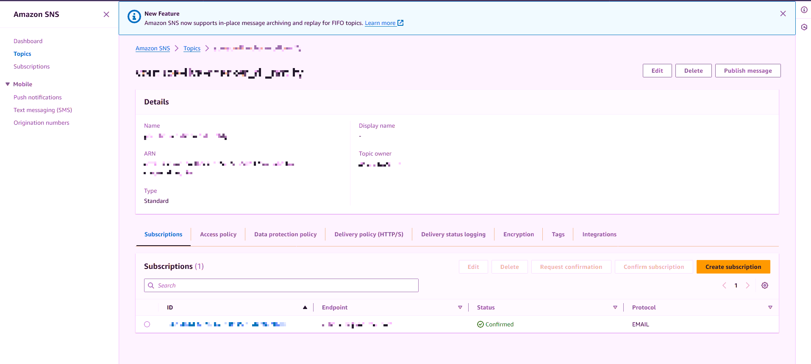
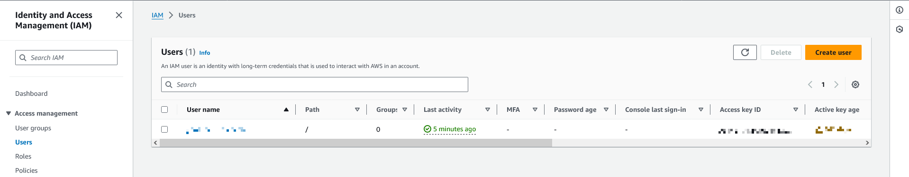
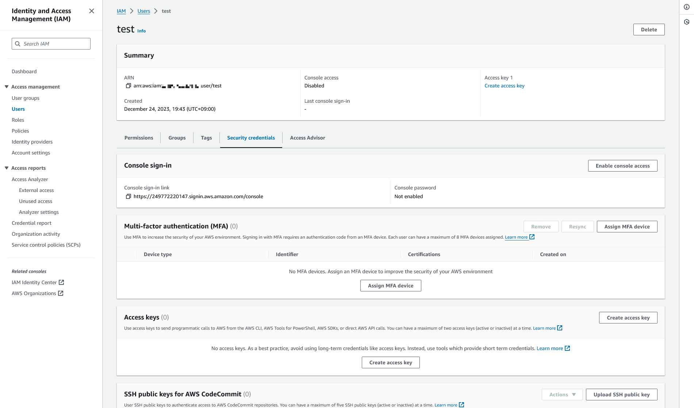
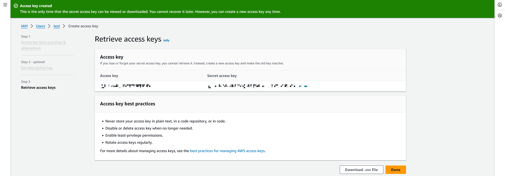

# youtube-live-checker
特定のYoutube Channelで配信が始まったら、録画と通知を行うツールです。

**このブランチはGoogle Cloud Platformで設計されたバージョンです。**  
ローカルで動作させる場合、[こちら](https://github.com/f122apg/youtube-live-checker/tree/master)をご確認ください。

## アーキテクチャ


## インストールについて
### 必要なもの
* Google Cloud Platform Account
* Amazon Web Service Account

### インストール方法
#### 事前準備
1. `cloud_functions`ブランチを`git clone`してください。
1. [tmpl_message_body.csv](https://github.com/f122apg/youtube-live-checker/blob/cloud_functions/gcp/cloud_scheduler/tmpl_message_body.csv)をコピーし、`message_body.csv`を作成してください。
1. `message_body.csv`に録画したいチャンネルのIDをカンマ区切りで入れてください。  
*ChannelIDは`@UserName`から変換して、`Uxxxxxxxxxxxxxxxxxxxxxxx`という形式の文字列を取得する必要があります。  
 ChannelIDは以下のツール等で取得可能です。  
https://www.streamweasels.com/tools/youtube-channel-id-and-user-id-convertor/

#### AWSの作業
1. Amazon SNSでトピックを作成してください。  
*リージョンは`ap-northeast-1`で作成してください。  
 もし、リージョンを変更する場合、`deploy.bat`のリージョンも変更してください。


1. 作成したトピックに紐づく、サブスクリプションを`Protocol: Email`で作成し、通知してほしいメールアドレスを設定してください。


1. トピックの詳細画面でARNをコピーしてください。GCPでデプロイする際に使用します。


1. AWS IAMでユーザーを作成してください。



1. PolicyはAmazonSNSFullAccessを適用してください。


1. [Create user]を押してください。


1. 作成したユーザーの詳細画面にアクセスし、[Create access key]を押してください。


1. [Local code]を選択してください。


1. [Create access key]を押してください。


1. `Access key`と`Secret access key`をコピーしてください。GCPでデプロイする際に使用します。


#### GCPの作業
1. Google Cloud Platformでプロジェクトを作成してください。
1. プロジェクトIDをコピーしてください。GCPでデプロイする際に使用します。

#### PCの作業
1. [gcloud](https://cloud.google.com/sdk/docs/install)をインストールし、[初期化](https://cloud.google.com/sdk/docs/initializing)を行ってください。
1. `deploy.bat`を実行してください。
1. 自動でGCPにデプロイされます。

#### 動作確認
1. GCPの[Workflowsの一覧画面](https://console.cloud.google.com/workflows)を開いてください。
1. `check_live`の詳細画面を開き、[実行]を押してください。
1. 以下のjsonを入れて、[実行]を押してください。
    ``` json
    {
      "contentId": "jNQXAC9IVRw",
      "title": "Me at the zoo"
    }
    ```

1. 右に表示されるフローでエラーが発生しなければデプロイに成功しています。

### 録画されたファイルの保存場所
Cloud Storageに保存しています。  
プロジェクトIDでbucketが作成されているので中身を確認してください。

### 録画したいチャンネルの追加や変更
録画対象のチャンネルはCloud Schedulerで管理しています。  
Cloud Schedulerの設定を変更することでチャンネルの追加や変更が可能です。

1. Cloud Schedulerを選択して編集します。


1. `Message body`にカンマ区切りでChannel IDを入れます。入れた後は更新ボタンを押してください。
